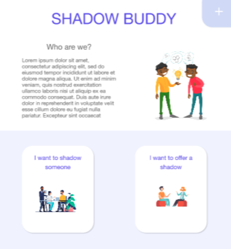
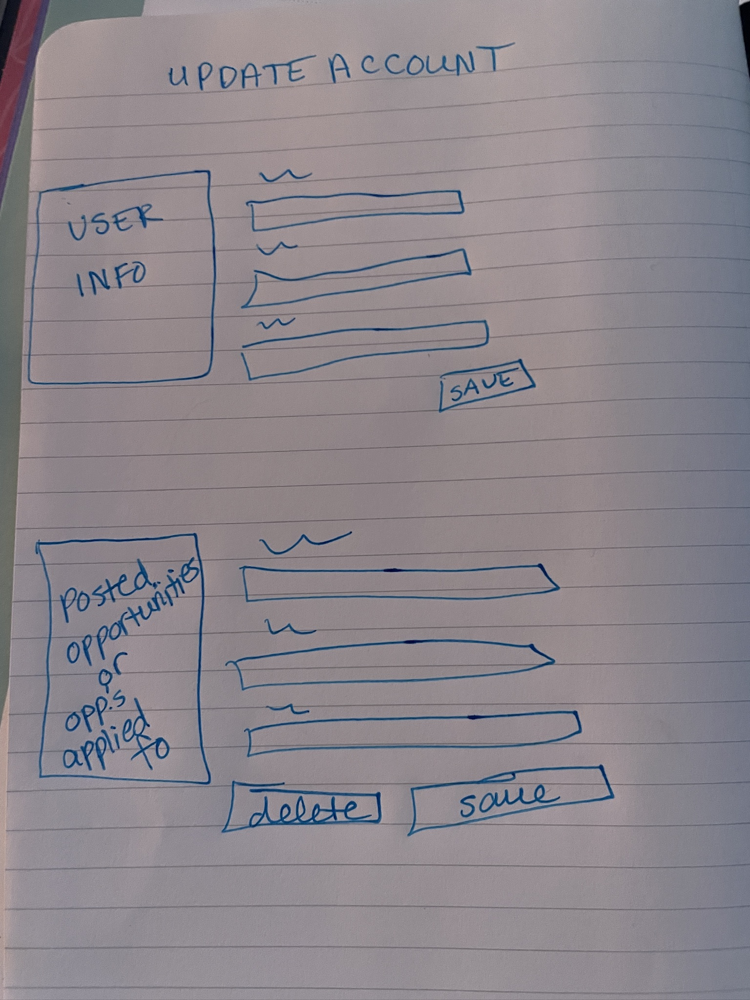
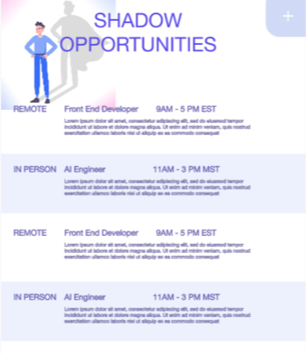
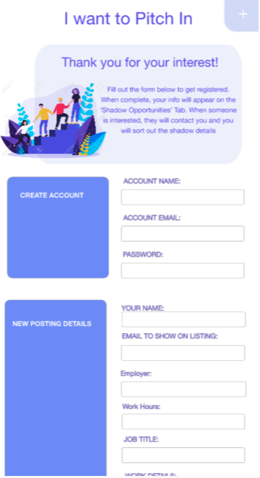
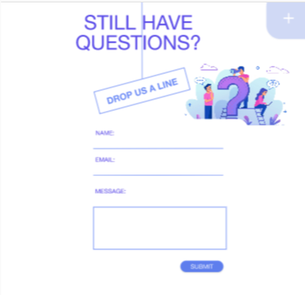
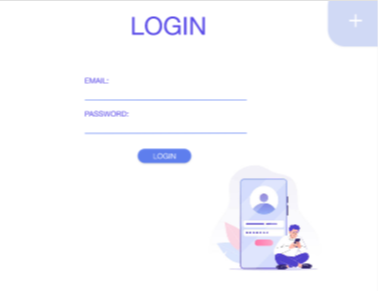

## Below is a list of descriptions for the pages that will be implemented for our project, TechShadow.

### For each page, it will include:
1. Page Title
2. Page Description (include a mockup or hand drawn image of the page)
3. Parameters needed for the page
4. Data needed to render the page
5. Link destinations for the page
6. List of tests for verifying the rendering of the page

# Page One: Landing Page
**Title:** Landing Page

**Description:** The main entry point for visitors, providing an overview of the platform and its purpose — connecting tech professionals with individuals seeking job shadowing opportunities.

**Parameters Needed:**
- If user is logged in, User ID (to display user name at top)
- If user is not logged in, None

**Data Needed:**
- No data is needed to/from backend if they are not logged in
- username need from "User" table if they are logged in

**Link Destinations:**
- Navbar links
    - Home: landing page
    - Login: login page
    - Shadow: Opportunities Page
    - Signup: Signup Page
    - contact: Contact Page
- In page links:
    - "I want to shadow someone" button: Opportunities Page
    - "I want to offer a shadow" button: Create Opportunity Page

**List of Tests:**
- test username loads correctly if user logged in

**Mockup**

---

# Page Two: Account Page
**Title:** Account Page

**Description:** A personalized page where users can manage their profile, view saved/created opportunities, and track shadowing requests.

**Parameters Needed:**
- User ID (identifies which user's account page is being accessed)
- Section (to navigate to user profile settings, created or saved opportunities, and shadow requests)
- Action (edit sections as needed)

**Data Needed:**
- Will need to GET User related information from the "User" table.
- Will need to GET Opportunities from the "Opportunities" table
- Will need to DELETE Oportunites from the "Opportunities" table

**Link Destinations:**
- Navbar links
    - Home: landing page
    - Login: login page
    - Shadow: Opportunities Page
    - Signup: Signup Page
    - contact: Contact Page
- In page links:
    - "Update account" button: directs to update account page

**List of Tests:**
- Test User data returned from backend is as expected based on user ID parameter
- Test all user data returned and accurate
- Test opportunities associated will user are returned from backend accurately
- Test deleted opportunities no longer exist in the table

**Mockup**

---

# Page Three: Opportunities Page
**Title:** Opportunities Page

**Description:** A listing of all available job shadowing opportunities, filtered by role, location, and other preferences.

**Parameters Needed:**
- Search query (Used to filter oppportunities based on keywords)
- Filters (parameters to search by role, location, date, times available, experience level)

**Data Needed:**
- Will need to GET Opportunities from the "Opportunities" table
- Will need to DELETE Opportunities from he "Opportunities" table (if they are created by the user)

**Link Destinations:**
- Navbar links
    - Home: landing page
    - Login: login page
    - Shadow: Opportunities Page
    - Signup: Signup Page
    - contact: Contact Page
- In page links:
    - No unpage links needed

**List of Tests:**
- Test get all opportunities requests returns correct number of opportunities
- Test all opportunity data is returned correctly and as expected
- Test filters/sorts return or present (depending on whether handled in front or backend) accurately
- Test "Search" functionality returns all matching opportunities as expected (by count)
- Test "Search" functionality does not return too many opportunites than expected (by count)

**Mockup**

---

# Page Four: Create an Opportunity Page
**Title:** Create an Opportunity Page

**Description:** A form where professionals can post new shadowing opportunities, including details like job role, location, times available, etc.

**Parameters Needed:**
- User ID (Identifies which use is creating the opportunity)
- Form (Form to fill out information for available opportunity)

**Data Needed:**
- Will need to POST to create Opportunities to "Opportunities" table
- Will need User ID to include in the "Opportunities" table

**Link Destinations:**
- Navbar links
    - Home: landing page
    - Login: login page
    - Shadow: Opportunities Page
    - Signup: Signup Page
    - contact: Contact Page
- In page links:
    - "Submit opportunity" button: links to Opportunities page (after sending data to backend)

**List of Tests:**
- Test required data is sent (required form fields not blank)(forms will all include front end validation as well)
- Test posted data is present and accurate in "Opportunities" table as expected
- Test Opportunity is associated with the correct posting user in table

**Mockup**

---

# Page Five: Contact Page
**Title:** Contact Page

**Description:** A simple page for users to reach out to the platform's support team with inquiries or feedback about the job shadowing experience.

**Parameters Needed:**
- Form (for user to fill out to contact company)

**Data Needed:**
- Nothing needed FROM database
- Will POST the users message to the "Contact_Messages" table

**Link Destinations:**
- Navbar links
    - Home: landing page
    - Login: login page
    - Shadow: Opportunities Page
    - Signup: Signup Page
    - contact: Contact Page
- In page links:
    - "Submit" button will send the contact message to the backend, user will stay on refreshed page

**List of Tests:**
- Test required data is sent (required form fields not blank)(forms will all include front end validation as well)
- Test posted data is present and accurate in "Contact_Messages" table as expected

**Mockup**

___

# Page Six: Login Page
**Title:** Login Page

**Description:** Simple page containing a login form that allows users to log into their accounts. Automatically redirects to Account page once the user successfully logs in.

**Parameters Needed:**
- Form (for user to fill out to login)

**Data Needed:**
- Will need to GET information from the "User" table to log user in

**Link Destinations:**
- Navbar links
    - Home: landing page
    - Login: login page
    - Shadow: Opportunities Page
    - Signup: Signup Page
    - contact: Contact Page
- In page links:
    - "Submit form button": directs to account page is successful after pushing info to backend
**List of Tests:**
- Test required data is sent (required form fields not blank)(forms will all include front end validation as well)
- Test request checks password and logs user in if username pass correct
- Test wrong username or password fails to login or get user past login wall

**Mockup**

___

# Page Seven: Signup Page
**Title:** Sign up Page

**Description:** Simple page containing a sign up form that allows users to create an accounts. Automatically redirects to Account page once the user successfully logs in.

**Parameters Needed:**
- Form (for user to fill out to create account)

**Data Needed:**
- Will need to POST information to the "User" table to create new users

**Link Destinations:**
- Navbar links
    - Home: landing page
    - Login: login page
    - Shadow: Opportunities Page
    - Signup: Signup Page
    - contact: Contact Page
- In page links:
    - "Submit form button": directs to account page if successful

**List of Tests:**
- Test required data is sent (required form fields not blank)(forms will all include front end validation as well)
- Test user new User created in User table
- Test USer data accurately represented in table

**Mockup**

___

# Page Eight: Update Account Page
**Title:** Update Account Page

**Description:** A form page that allows user to updte their account information.

**Parameters Needed:**
- User ID (identifies which Users account page is being processed)
- Action (edit sections as needed)

**Data Needed:**
- Will need to PUT User related information to update the "User" table.
- Will need user ID

**Link Destinations:**
- Navbar links
    - Home: landing page
    - Login: login page
    - Shadow: Opportunities Page
    - Signup: Signup Page
    - contact: Contact Page
- In page links:
    - "Update account" button: directs to update account page after sending info to backend

**List of Tests:**
- Test required data is sent (required form fields not blank)(forms will all include front end validation as well)
- Test updated data is present and accurate in "Accounts" table as expected

**Mockup**

